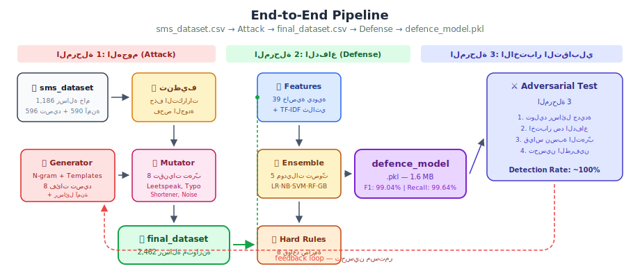
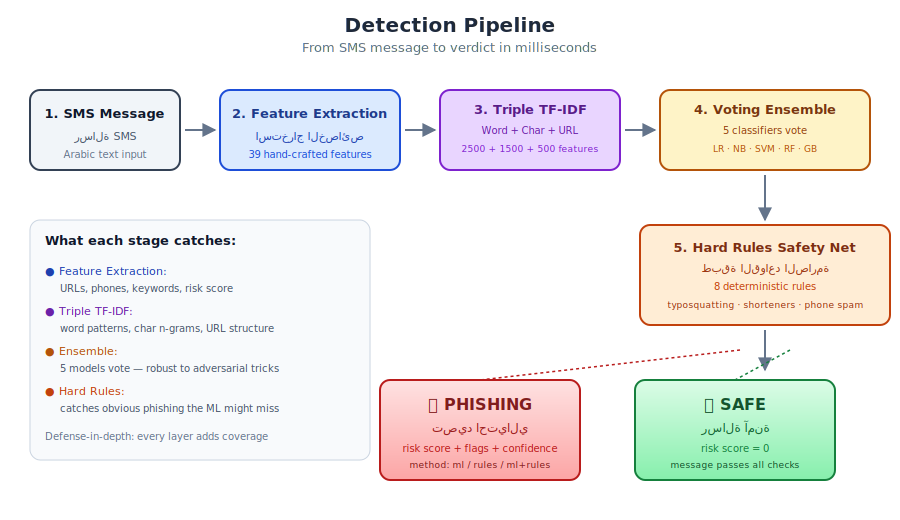
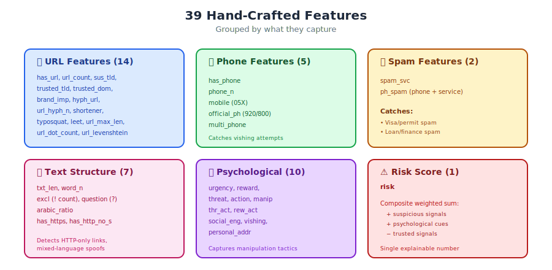

[](https://classroom.github.com/a/JI_w90Hz)
# 🎓 Capstone Project

Congratulations! 🎉  
You’ve reached your final milestone in this program — your Capstone Project.

This is your opportunity to apply everything you’ve learned and build something meaningful.

---

## 🧠 Project Overview

Each team will work on a different idea or use case.  
There is no single “correct” solution — focus on building something that works and makes sense.

---

## 👥 Team Work

- Organize your work clearly between team members  
- Assign roles (e.g., data, backend, modeling, etc.)
- Communicate regularly and support each other  
- Make sure everyone contributes

---

## 🌿 Development Workflow

- Use GitHub properly  
- Work with branches (don’t push everything to main)
- Write clear commit messages  
- Keep your repository clean and organized  

---

## 🔄 Versioning (Important)

- Don’t wait until the end to submit your project  
- Keep updating your work step by step  
- After every major progress, create a version:

  - V1 → basic idea working  
  - V2 → improved pipeline  
  - V3 → better results / optimization  

- This helps you:
  - Track your progress  
  - Avoid losing work  
  - Show your development journey  

---

## 📦 What to Deliver

- A working project (end-to-end)
- Clean and structured code
- A clear README explaining your project
- Simple demo or examples

---

## 💡 Tips

- Start simple, then improve  
- Don’t overcomplicate things  
- Focus on completing a working system  
- Test your project properly  

---

## 🚀 Final Note

This project represents your journey.  
Take it seriously, be proud of your work, and enjoy the process.

Good luck! 🔥

<div align="center">

# 🛡️ Arabic SMS Phishing Defense

### نظام كشف رسائل التصيد الاحتيالي في الرسائل النصية العربية

**End-to-end ML system: Attack simulation → Dataset generation → Phishing detection**

[](https://www.python.org/downloads/)
[](https://scikit-learn.org/)
[](LICENSE)
[]()
[]()

</div>

---

## 📖 المشكلة

رسائل التصيد الاحتيالي (SMS Phishing) تستهدف المستخدمين في السعودية بأساليب متطورة:
- انتحال هوية شركات الاتصالات والبنوك (`stc-secure.cc`)
- تقليد النطاقات الحقيقية (`bankalbilad.com.golv`)
- استخدام leetspeak لتجاوز الفلاتر (`za1n` بدل `zain`)
- روابط مختصرة تخفي الوجهة الحقيقية (`bit.ly/abc`)
- رسائل هندسة اجتماعية بدون أي رابط

**هذا المشروع يبني نظام دفاع متكامل يكشف كل هذه الأساليب.**

---

## 🏗️ الـ Pipeline الكامل

<div align="center">
  
</div>

المشروع ينقسم إلى **3 مراحل متتابعة**:

### المرحلة 1: الهجوم (Attack Simulator)
يأخذ البيانات الخام → ينظّفها → يتعلم الأنماط → يولّد رسائل تصيد وآمنة متنوعة → يخرج الـ **final_dataset.csv**

### المرحلة 2: الدفاع (Defense Model)
يأخذ `final_dataset.csv` جاهز → يستخرج 39 خاصية → يبني TF-IDF ثلاثي → يدرّب 5 موديلات → يخرج الـ **defence_model.pkl**

### المرحلة 3: الاختبار التقابلي (Adversarial)
بعد ما الطرفين جاهزين → يولّد رسائل جديدة → يطبّق تقنيات تهرّب → يختبرها ضد الدفاع → يقيس الثغرات

```
sms_dataset.csv ──→ [الهجوم] ──→ final_dataset.csv ──→ [الدفاع] ──→ defence_model.pkl ──→ [الاختبار]
```

---

## 📁 هيكل المشروع

```
arabic-sms-phishing-defense/
│
├── data/
│   ├── raw/sms_dataset.csv                 # البيانات الخام (1,186 رسالة)
│   └── processed/final_dataset.csv         # الناتج النهائي (2,462 رسالة)
│
├── attack/                                  # 🔴 المرحلة 1
│   ├── src/
│   │   ├── config.py                       # العلامات التجارية والثوابت
│   │   ├── generator.py                    # NgramModel + PhishingGenerator
│   │   └── mutator.py                      # 8 تقنيات تهرّب
│   ├── notebooks/ (5)                      # من التنظيف إلى بناء الداتا سيت
│   └── models/attack_generator.pkl
│
├── defense/                                 # 🟢 المرحلة 2
│   ├── src/
│   │   ├── config.py                       # القوائم والثوابت
│   │   ├── features.py                     # 39 خاصية يدوية
│   │   ├── rules.py                        # 8 قواعد صارمة
│   │   └── detector.py                     # PhishingDetector (API الرئيسي)
│   ├── notebooks/ (5)                      # من الاستكشاف إلى الاختبار
│   ├── models/defence_model.pkl            # الموديل المدرّب (1.6 MB)
│   └── tests/test_detector.py
│
├── adversarial/                             # 🔵 المرحلة 3
│   ├── src/evaluator.py                    # يختبر الهجوم ضد الدفاع
│   └── notebooks/01_adversarial_testing.ipynb
│
└── docs/images/ (6 SVG diagrams)
```

---

## 🚀 Quick Start

### التثبيت

```bash
git clone https://github.com/YOUR_USERNAME/arabic-sms-phishing-defense.git
cd arabic-sms-phishing-defense
pip install -r requirements.txt
```

### استخدام موديل الدفاع (سطرين)

```python
from defense.src.detector import PhishingDetector

detector = PhishingDetector("defense/models/defence_model.pkl")
result = detector.predict("تحذير! ادخل على stc-portal.cc لتأمين حسابك")

print(result["label_ar"])        # "تصيد احتيالي"
print(result["risk_score"])      # 10.0
print(result["flags"])           # ["رابط بنطاق مشبوه", "انتحال هوية علامة تجارية"]
print(result["detection_method"])# "ml+rules"
```

### الـ API الكامل

```python
result = detector.predict("نص الرسالة")

# Returns:
{
    "is_phishing":      True,                # bool
    "label":            "phishing",          # "phishing" / "safe"
    "label_ar":         "تصيد احتيالي",      # Arabic label
    "confidence":       "high",              # "high" / "medium" / "low"
    "risk_score":       10.0,                # 0 to ~25
    "flags":            ["رابط بنطاق مشبوه"],  # Arabic reasons
    "detection_method": "ml+rules",          # "ml" / "rules" / "ml+rules"
}
```

---

## ⚔️ المرحلة 1: الهجوم (Attack Simulator)

**المهمة:** تحويل 1,186 رسالة خام إلى 2,462 رسالة متوازنة ومتنوعة.

### كيف يعمل

1. **تنظيف البيانات** — حذف التكرارات والرسائل الفارغة
2. **تحليل الأنماط** — فهم كيف يبني المحتالون رسائلهم
3. **تدريب N-gram** — تعلّم تسلسل الكلمات العربية
4. **التوليد** — رسائل جديدة عبر قوالب + تعبئة ذكية
5. **البناء** — تجميع الداتا سيت النهائية

### 8 فئات تصيد

| الفئة | النسبة | المثال |
|-------|:------:|--------|
| 🔗 انتحال علامة تجارية | 25% | `stc-secure.cc` — رابط مشبوه باسم شركة |
| 🎁 جوائز وهمية | 15% | "مبروك فزت بجائزة!" |
| 📦 شحنات مزيفة | 15% | "شحنتك محتجزة" |
| 🏛️ حكومي مزيف | 12% | "أبشر: حدّث بياناتك" |
| 📱 احتيال هاتفي | 12% | رقم جوال + تهديد أو سبام |
| 🔢 تشفير حروف | 8% | `za1n.com.sa` بدل `zain.com.sa` |
| 🔄 روابط مختصرة | 8% | `bit.ly/abc123` |
| 🧠 هندسة اجتماعية | 5% | رسائل بدون رابط ولا رقم |

### 8 تقنيات تهرّب (Adversarial Mutations)

| التقنية | الوصف |
|---------|-------|
| Leetspeak | `zain` → `za1n` |
| Typosquatting | `bankalbilad.com` → `bankalbilad.com.golv` |
| URL Shortening | أي رابط → `bit.ly/xxx` |
| Char Duplication | `تحذير` → `تححذير` |
| Synonym Swap | `تحذير` → `تنويه` |
| Word Reorder | إعادة ترتيب الكلمات |
| Zero-width Chars | أحرف غير مرئية في الروابط |
| Arabic Noise | أحرف تشويش عربية |

### النوتبوكس

| # | Notebook | المهمة |
|:-:|----------|--------|
| 01 | `data_cleaning` | تنظيف sms_dataset.csv |
| 02 | `corpus_analysis` | تحليل أنماط التصيد |
| 03 | `generator_training` | تدريب N-gram generator |
| 04 | `message_generation` | توليد رسائل (8 فئات + آمنة) |
| 05 | `build_final_dataset` | تجميع → final_dataset.csv |

---

## 🛡️ المرحلة 2: الدفاع (Defense Model)

**المهمة:** بناء موديل يكشف التصيد بدقة عالية وسرعة.

### 3 طبقات دفاع

<div align="center">
  
</div>

**الطبقة 1 — Feature Engineering (39 خاصية يدوية):**

<div align="center">
  
</div>

| المجموعة | العدد | أمثلة |
|----------|:-----:|-------|
| 🔗 URL | 14 | `sus_tld`, `brand_imp`, `typosquat`, `leet`, `shortener`, `url_levenshtein` |
| 📞 Phone | 5 | `mobile` (05X), `official_ph` (920/800), `multi_phone` |
| 🚫 Spam | 2 | `spam_svc`, `ph_spam` |
| 📝 Text | 7 | `txt_len`, `arabic_ratio`, `has_https` |
| 🧠 Psychology | 10 | `urgency`, `reward`, `threat`, `action`, `social_eng` |
| ⚠️ Risk | 1 | `risk` (composite weighted score) |

**الطبقة 2 — Triple TF-IDF + Voting Ensemble:**

| TF-IDF | Features | ماذا يلتقط |
|--------|:--------:|------------|
| Word-level | 2,500 | عبارات كاملة ("قم بتحديث بياناتك") |
| Char-level | 1,500 | أنماط الحروف |
| URL-only | 500 | أنماط الروابط المشبوهة |

5 موديلات تصوّت: Logistic Regression · Complement NB · Linear SVM · Random Forest · Gradient Boosting

**الطبقة 3 — Hard Rules (8 قواعد صارمة):**

| القاعدة | المنطق |
|---------|--------|
| R1-R2 | Suspicious TLD + brand أو hyphen → تصيد |
| R3 | Typosquatting / leetspeak → تصيد |
| R4 | URL shortener → تصيد دائماً |
| R5 | مكافآت متعددة + رابط غير موثوق → تصيد |
| R6 | تهديد + حث + رابط غير موثوق → تصيد |
| R7 | رقم جوال + خدمة سبام → تصيد |
| R8 | رقم جوال + تهديد + حث (بدون رقم رسمي) → تصيد |

### النوتبوكس

| # | Notebook | المهمة |
|:-:|----------|--------|
| 01 | `data_exploration` | استكشاف final_dataset |
| 02 | `feature_engineering` | شرح الـ 39 feature |
| 03 | `model_training` | تدريب Ensemble |
| 04 | `evaluation` | تقييم + confusion matrix |
| 05 | `test_model` | **اختبار تفاعلي — للـ frontend team** |

---

## ⚔️ المرحلة 3: الاختبار التقابلي (Adversarial)

**المهمة:** بعد ما الهجوم والدفاع جاهزين، نختبرهم ضد بعض.

```
الهجوم يولّد رسائل جديدة
    ↓
يطبّق تقنيات تهرّب (mutations)
    ↓
يختبرها ضد defence_model.pkl
    ↓
يقيس: كم واحدة فاتت؟ أي تقنية أنجح؟
    ↓
النتائج تُستخدم لتحسين الدفاع والهجوم
```

---

## 📊 النتائج

<div align="center">
  
</div>

| المقياس | القيمة |
|---------|:------:|
| **Accuracy** | 98.90% |
| **Recall** (تصيد مكتشف) | **99.64%** |
| **Precision** (دقة التنبيهات) | 98.44% |
| **F1 Score** | 99.04% |
| **سرعة التنبؤ** | <10ms |

**Confusion Matrix:**

|  | Predicted Safe | Predicted Phishing |
|--|:-:|:-:|
| **Actual Safe** | 1,048 ✓ | 22 |
| **Actual Phishing** | 5 | 1,387 ✓ |

---

## 📓 ترتيب تشغيل النوتبوكس

```
attack/notebooks/01 → 02 → 03 → 04 → 05
                                        ↓
                            final_dataset.csv
                                        ↓
defense/notebooks/01 → 02 → 03 → 04 → 05
                                        ↓
                            defence_model.pkl
                                        ↓
adversarial/notebooks/01
```

```bash
jupyter notebook
```

---

## 🧪 Testing

```bash
python defense/tests/test_detector.py
```

يختبر: استخراج الدومينات، typosquatting، leetspeak، الـ 8 hard rules، 7 حالات تصيد صعبة (regression)، 5 حالات آمنة.

---

## 🤝 للفرق الأخرى

**للـ frontend/backend team:**

كل اللي تحتاجون:

```python
from defense.src.detector import PhishingDetector
detector = PhishingDetector("defense/models/defence_model.pkl")
result = detector.predict("نص الرسالة")
```

شوفوا [`defense/notebooks/05_test_model.ipynb`](defense/notebooks/05_test_model.ipynb) لمثال كامل.

---

## 📄 License

MIT License — see [LICENSE](LICENSE) for details.

---

<div align="center">

**Attack to defend. Defend to attack. 🛡️⚔️**

</div>
